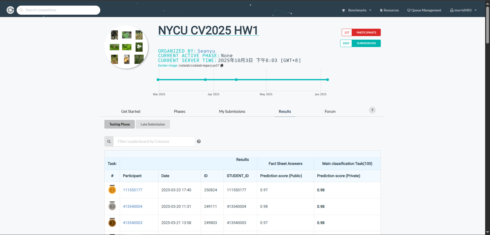

# NYCU Computer Vision 2025 Spring HW1
**StudentID** : **111550177** \
**Name** : **Ting-Lin Wu (吳定霖)**

## Introduction
This assignment is an image classification competition. It consists of photos from 100 different categories, where each category represents a specific biological species. The dataset includes a total of 21,024 images for training and validation, along with 2,344 test images.

The model is restricted to using ResNet as the backbone, including some of its variants (such as ResNeXt, ResNeSt, etc.). Pretrained weights trained on ImageNet can be utilized. The model size is limited to 100 million parameters. Additionally, ensemble learning can be applied to aggregate the outputs of multiple models.


## How to install
How to install dependences
```bash
# clone this repo
git clone https://github.com/morris0401/NYCU_VRDL.git
cd NYCU_VRDL/HW1

# create environment
conda create -n VRDL_hw1 python=3.9
conda activate VRDL_hw1
pip install -r requirements.txt
```

## How to install dataset
```bash
mkdir dataset
cd dataset
gdown --id 1fx4Z6xl5b6r4UFkBrn5l0oPEIagZxQ5u
tar -xvzf hw1-data.tar.gz
```

## How to run
How to execute the code
```
# Training
python train.py

# Validation
python inference.py

# Testing
python testing.py
```

## Model Weight Download
[https://drive.google.com/file/d/16hXRgvPhdSMpYmQfx9JQ88v4HSfgqEbC/view?usp=sharing](https://drive.google.com/file/d/16hXRgvPhdSMpYmQfx9JQ88v4HSfgqEbC/view?usp=sharing)

## Performance snapshot
A shapshot of the leaderboard

