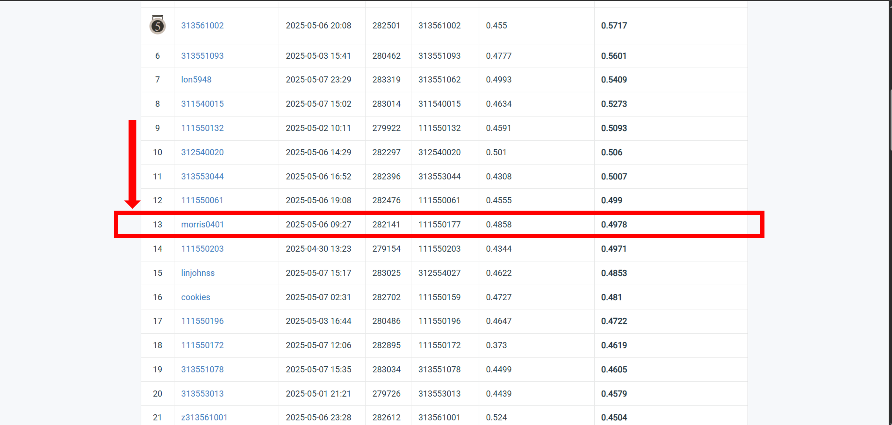

# NYCU Computer Vision 2025 Spring HW3
**StudentID** : **111550177** \
**Name** : **Ting-Lin Wu (吳定霖)**

## Introduction
This assignment is an object detection competition. It consists of some objects in each photo from 10 different categories, where each category represents a specific decimal digit in some scenes, from 0 to 9. The dataset includes a total of 30,062/3,340 images for training and validation, along with 13,068 test images.  

There are two tasks in this competition. Task 1 is predicting the class and bounding box of each digit in the image. Task 2 is predicting all digits in the images. When doing task 2, you can only use the results from task 1

The model is restricted to using Faster R-CNN as the model. The model should contain 3 components: (1) The backbone to extract features. (2) RPN (Region Proposal Network) to generate regions of interest. (3) Heads to predict bounding box or classify the object category. Pretrained weight can be utilized. There are no model size limitations.

This github repository is modified from [https://github.com/GirinChutia/FasterRCNN-Torchvision-FineTuning/tree/main](https://github.com/GirinChutia/FasterRCNN-Torchvision-FineTuning/tree/main)

## How to install
How to install dependences
```bash
# clone this repo
git clone https://github.com/morris0401/NYCU_VRDL.git
cd NYCU_VRDL/HW3

# create environment
conda create -n VRDL_hw2 python=3.11
conda activate VRDL_hw2
pip install -r requirements.txt
```

## How to install dataset
```bash
mkdir models
mkdir dataset
cd dataset
gdown --id 13JXJ_hIdcloC63sS-vF3wFQLsUP1sMz5
tar -xvzf nycu-hw2-data.tar.gz
```

## How to run
How to execute the code
```
# Training
python ./code/train.py

# Testing
python ./code/test.py
```

## Model Weight Download
[https://drive.google.com/file/d/1RJi2zTRmbzm3LwWCrUEm0TPFAzCNgq7g/view?usp=sharing](https://drive.google.com/file/d/1RJi2zTRmbzm3LwWCrUEm0TPFAzCNgq7g/view?usp=sharing)

## Performance snapshot
A shapshot of the leaderboard

