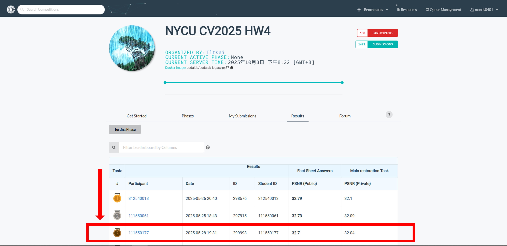

# NYCU Computer Vision 2025 Spring HW4
**StudentID** : **111550177** \
**Name** : **Ting-Lin Wu (吳定霖)**

## Introduction
This assignment focuses on the task of instance segmentation in colored medical images. The dataset contains colored medical images with instances of 4 different types of cells (class1, class2, class3, and class4). The dataset consists of 209 images for training and validation and 101 images for testing. The raw images and masks are provided in .tif format, requiring data processing for model training and evaluation.
The primary goal of this assignment is to train instance segmentation models to predict the segmentation masks for each instance of the target cells. Predicted masks need to be converted into a specific submission format.
For this task, we are required to develop a model based on Mask R-CNN [1]. The model should typically comprise key components: (1) The backbone responsible for extracting feature maps from the input images. (2) The Region Proposal Network (RPN) [3] to generate regions of interest that potentially contain objects. (3) The heads, which extend the object detection heads of Faster R-CNN [2] to predict the bounding box, class, and importantly, a segmentation mask for each proposed region. Pretrained weights, specifically from ImageNet [3], are permitted. A key constraint for this assignment is that the total number of trainable parameters in the model must be less than 200 million.


## How to install
How to install dependences
```bash
# clone this repo
git clone https://github.com/morris0401/NYCU_VRDL.git
cd NYCU_VRDL/HW3

# create environment
conda create -n VRDL_hw3 python=3.11
conda activate VRDL_hw3
pip install -r requirements.txt
```

## How to install dataset
```bash
mkdir models
mkdir dataset
cd dataset
gdown --id 1B0qWNzQZQmfQP7x7o4FDdgb9GvPDoFzI
tar -xvzf hw3-data-release.tar.gz
```

## How to run
How to execute the code
```
# Training
python ./code/train.py

# Testing
python ./code/test.py
```

## Model Weight Download
[https://drive.google.com/file/d/1DB58w778_kE1TYBj6i2B4P2D7QBxWOZB/view?usp=sharing](https://drive.google.com/file/d/1DB58w778_kE1TYBj6i2B4P2D7QBxWOZB/view?usp=sharing)

## Performance snapshot
A shapshot of the leaderboard


## Reference 
[1] K. He, G. Gkioxari, P. Dollár, and R. B. Girshick, ‘Mask R-CNN’, CoRR, vol. abs/1703.06870, 2017.
[2] S. Ren, K. He, R. B. Girshick, and J. Sun, ‘Faster R-CNN: Towards Real-Time Object Detection with Region Proposal Networks’, CoRR, vol. abs/1506.01497, 2015.
[3] O. Russakovsky et al., ‘ImageNet Large Scale Visual Recognition Challenge’, CoRR, vol. abs/1409.0575, 2014.

## Installation and Data Preparation

See [INSTALL.md](INSTALL.md) for the installation of dependencies and dataset preperation required to run this codebase.

## Training

After preparing the training data in ```data/``` directory, use 
```
python train.py
```
to start the training of the model. Use the ```de_type``` argument to choose the combination of degradation types to train on. By default it is set to all the 3 degradation types (noise, rain, and haze).

Example Usage: If we only want to train on deraining and dehazing:
```
python train.py --de_type derain dehaze
```

## Testing

After preparing the testing data in ```test/``` directory, place the mode checkpoint file in the ```ckpt``` directory. The pretrained model can be downloaded [here](https://drive.google.com/file/d/1j-b5Od70pGF7oaCqKAfUzmf-N-xEAjYl/view?usp=sharingg), alternatively, it is also available under the releases tab. To perform the evalaution use
```
python test.py --mode {n}
```
```n``` is a number that can be used to set the tasks to be evaluated on, 0 for denoising, 1 for deraining, 2 for dehaazing and 3 for all-in-one setting.

Example Usage: To test on all the degradation types at once, run:

```
python test.py --mode 3
```

## Demo
To obtain visual results from the model ```demo.py``` can be used. After placing the saved model file in ```ckpt``` directory, run:
```
python demo.py --test_path {path_to_degraded_images} --output_path {save_images_here}
```
Example usage to run inference on a directory of images:
```
python demo.py --test_path './test/demo/' --output_path './output/demo/'
```
Example usage to run inference on an image directly:
```
python demo.py --test_path './test/demo/image.png' --output_path './output/demo/'
```
To use tiling option while running ```demo.py``` set ```--tile``` option to ```True```. The Tile size and Tile overlap parameters can be adjusted using ```--tile_size``` and ```--tile_overlap``` options respectively.


## Results
Performance results of the PromptIR framework trained under the all-in-one setting

<summary><strong>Table</strong> </summary>

 

<summary><strong>Visual Results</strong></summary>

The visual results of the PromptIR model evaluated under the all-in-one setting can be downloaded [here](https://drive.google.com/drive/folders/1Sm-mCL-i4OKZN7lKuCUrlMP1msYx3F6t?usp=sharing)


## Citation
If you use our work, please consider citing:

    @inproceedings{potlapalli2023promptir,
      title={PromptIR: Prompting for All-in-One Image Restoration},
      author={Potlapalli, Vaishnav and Zamir, Syed Waqas and Khan, Salman and Khan, Fahad},
      booktitle={Thirty-seventh Conference on Neural Information Processing Systems},
      year={2023}
    }


## Contact
Should you have any questions, please contact pvaishnav2718@gmail.com


**Acknowledgment:** This code is based on the [AirNet](https://github.com/XLearning-SCU/2022-CVPR-AirNet) and [Restormer](https://github.com/swz30/Restormer) repositories. 

